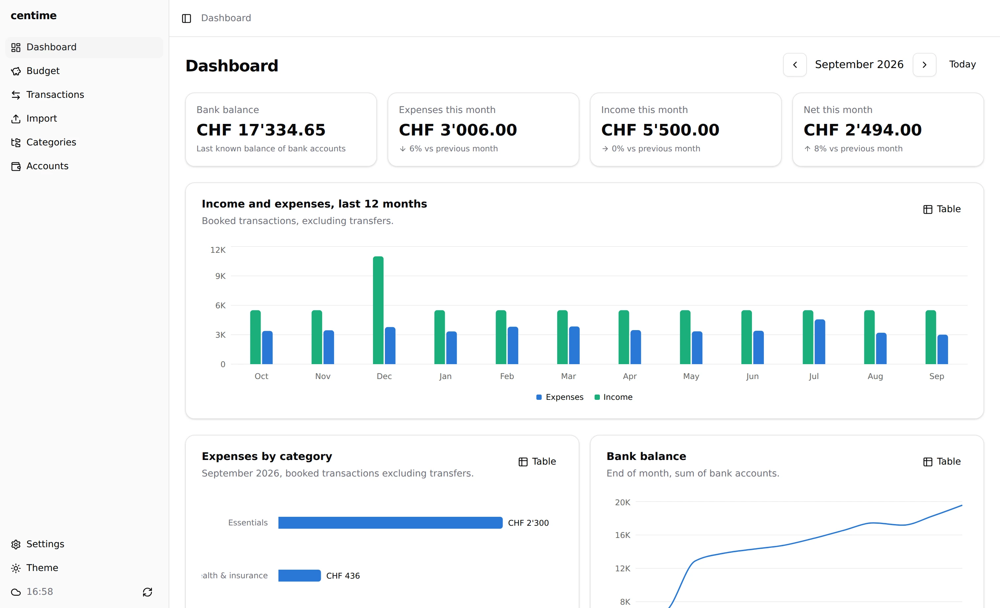
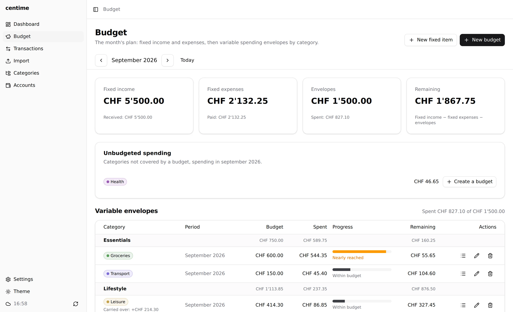
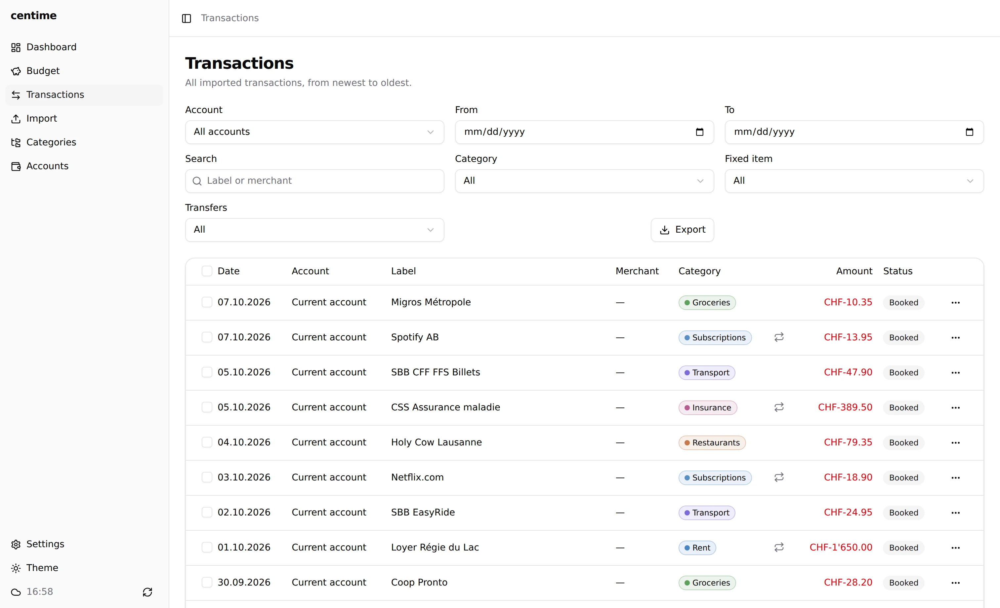
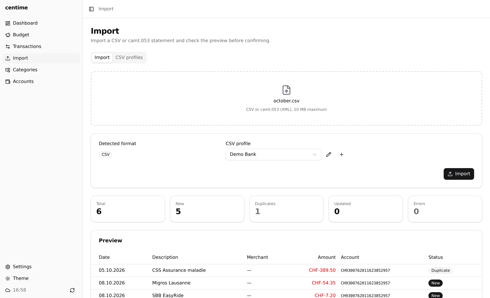
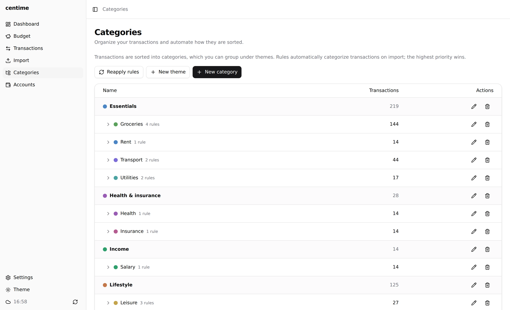

# centime

Personal, single-user budget management app. Data is end-to-end encrypted: the server is only a relay that stores opaque blobs.

<picture>
  <source media="(prefers-color-scheme: dark)" srcset="site/screenshots/dashboard-dark.webp">
  
</picture>

## Features

- **Import**: CSV statements (configurable provider profiles) and camt.053 (XML), duplicate detection, update of pending transactions.
- **Manual entry**: add from the Transactions page an operation missing from the statements (account, date, label, merchant, amount, category).
- **Categories and rules**: categories grouped by theme (transactions are filed under categories), "contains" or regex rules on the label, the merchant or the provider category, applied at import time or on demand.
- **Fixed items**: recurring expenses and income (monthly, quarterly, yearly), automatic transaction matching, upcoming and overdue items.
- **Budgets**: per-category caps, balance carry-over, projection at the current pace, history.
- **Month plan**: fixed items and budgets on a single page, with the remainder of the month (fixed income − fixed expenses − envelopes).
- **Dashboard**: bank balance, spending, income and net for the month compared with the previous month, points of attention, 12-month income and spending, spending by category, balance trend, budgets, due dates and latest transactions.
- **Updates**: Settings shows the installed version, then installs the new release (desktop) or downloads the APK (Android).
- **Export**: CSV export (`;` separator, UTF-8 with BOM) of transactions, following the filters of the Transactions page (saved in the app's Download folder on Android).

## Screenshots

| | |
| --- | --- |
| <picture><source media="(prefers-color-scheme: dark)" srcset="site/screenshots/budgets-dark.webp"></picture> *Month plan: fixed items and envelopes* | <picture><source media="(prefers-color-scheme: dark)" srcset="site/screenshots/transactions-dark.webp"></picture> *Transactions, filters and CSV export* |
| <picture><source media="(prefers-color-scheme: dark)" srcset="site/screenshots/import-dark.webp"></picture> *Import preview with duplicate detection* | <picture><source media="(prefers-color-scheme: dark)" srcset="site/screenshots/categories-dark.webp"></picture> *Categories, themes and rules* |

## Structure

- `packages/core`: domain types and pure business logic.
- `packages/db`: Drizzle schema (SQLite / libSQL), bundled migrations and a portable migrator.
- `packages/services`: shared business logic (accounts, imports, transactions, rules, budgets, sync row schemas), independent of both the server runtime and the browser.
- `apps/server`: Hono relay API (encrypted log storage on `bun:sqlite`) and web build serving. It holds no business data and no business logic.
- `apps/web`: React UI (Vite, TanStack Router, TanStack Query, shadcn/ui), shared between web and desktop. Encryption and synchronization run here, in `src/lib/crypto` and `src/lib/sync`.
- `apps/desktop`: Tauri 2 shell of the desktop application.

## Prerequisites

- Bun 1.3.6 or newer (see the `packageManager` field of `package.json`). Install: https://bun.sh/docs/installation, for example `curl -fsSL https://bun.sh/install | bash`.

## Installation

```sh
bun install
cp .env.example .env
```

All server variables have defaults; edit `.env` only to change them. `ALLOWED_ORIGINS` (comma-separated, for example `https://you.github.io`) lets a web UI hosted on another origin reach the relay; leave it empty when the relay serves the UI itself.

### Static hosting (GitHub Pages)

The web UI also runs as a plain static site, without the relay:

```sh
BASE_PATH=/centime/app/ bun run --cwd apps/web build:static
```

`BASE_PATH` is the path the app is served under (default `/`). The output goes to `apps/web/dist-static`, with a `404.html` copy of `index.html` so deep links work. The `Deploy site` workflow publishes it under `app/` next to the marketing site.

Synchronization is optional: enter a relay address at first launch or later in **Settings › Synchronization**. That relay must list the static site origin in `ALLOWED_ORIGINS`.

Without a relay, the data lives only in the browser's IndexedDB, which the browser may clear (storage pressure, site data cleanup, private mode). Configure a relay, or export your transactions regularly.

## Development

```sh
bun run dev
```

- API: http://localhost:3000
- UI: http://localhost:5173 (proxies `/api` to the API)

The relay database is created on first start, by default in `data/relay.db`.

## Commands

| Command | Purpose |
| --- | --- |
| `bun run build` | Type-checks core, db and services, then builds the web UI |
| `bun run typecheck` | Type-checks every package |
| `bun run test` | Unit tests (`bun test`), package by package |
| `bun run db:generate` | Generates a migration after a schema change and regenerates `migrations.generated.ts` |
| `bun run db:bundle` | Regenerates `migrations.generated.ts` from the `drizzle/` folder |
| `bun run db:migrate` | Applies migrations without starting the server |
| `bun run desktop:dev` | Runs the desktop app in development |
| `bun run desktop:build` | Builds the desktop installer |

`bun test` at the root also runs every test in a single report.

The server has no build step: Bun runs the TypeScript directly. After `bun run build`, start the app with `bun run start`.

## Encryption model

Each client (browser or desktop) keeps its own SQLite database with all the business data. The server never sees it in clear text.

- **Master key**: 32 random bytes generated on the client. It is shown to the user as a recovery key: Crockford base32 in groups of four characters, with a 2-byte checksum so typos are detected (`I`, `L` and `O` are accepted for `1`, `1` and `0`). Anyone holding this key can read the data; losing it makes the data unrecoverable.
- **Derived values** (HKDF-SHA-256, salt `centime/v1`): a public **user id** (32 hex characters), an **auth secret** and an **AES-256-GCM encryption key**. The master key itself never leaves the device.
- **Sealed blobs**: each payload is encrypted with a random 12-byte IV, prefixed by a format version byte, with the user id bound as additional authenticated data.
- **Authentication**: requests carry `Authorization: Bearer <userId>.<secret>`. The server stores only the SHA-256 hash of the secret and compares it in constant time. There is no password and no session.

Because the server cannot read or merge data, conflict resolution happens on the clients (see below).

## Relay API

All routes live under `/api`. Bodies are JSON; `data` is base64 of a sealed blob (8 MiB max per entry, 9 MiB max per request).

| Route | Description |
| --- | --- |
| `GET /api/health` | Returns `{ "status": "ok" }` |
| `POST /api/log` | Appends `{ "data" }` to the user's log and returns `{ "seq" }` (201). The first append from an unknown user id creates the account (403 if signups are closed); later appends need the matching secret (401 otherwise) |
| `GET /api/log?since=<seq>&limit=<n>` | Returns `{ entries: [{ seq, data }], cursor, hasMore }` for entries after `since`. `limit` defaults to 200 and is capped at 500; a page is also capped at 8 MiB. Call again with the returned `cursor` while `hasMore` is `true` |
| `DELETE /api/account` | Deletes the user and the whole log (204) |

The log is append-only: entries are numbered per user with a gapless sequence (`seq`), stored in SQLite (WAL mode).

## Synchronization

The server is a dumb, ordered log; clients do the merging.

1. **Pull**: a client reads the log from its stored cursor, page by page, decrypts each entry and applies the rows it contains.
2. **Push**: local rows not yet sent (`sync_version` is `NULL`) are sent in batches, each sealed and appended to the log. Accepted rows get their sequence number as `sync_version`.
3. **Conflicts** are resolved locally when a row is applied: the most recent `updatedAt` wins, even over an already-synchronized local row, so a server cannot replay a stale entry. When two devices create the same account or import the same transaction offline, the smallest id wins everywhere; the losing account is recorded as an alias (`sync_alias:<id>` setting) so transactions that still reference it are remapped.
4. An entry that fails to decrypt aborts the sync with an error: the key does not match, or the data was tampered with.

Synchronization runs at startup, every 5 minutes, 5 seconds after each change and on demand from the sidebar.

## Desktop app

The desktop app is the same UI as the web one, packaged with Tauri 2. It works offline: the business services run in the window, on a local SQLite database (sql.js in WebAssembly).

### Installing a release

Installers are attached to each tagged version. They are **not code-signed** yet, so your OS warns you on first launch:

- **Windows**: SmartScreen shows "Windows protected your PC". Click **More info**, then **Run anyway**.
- **macOS**: Gatekeeper refuses to open the app. Right-click (or Control-click) the app, choose **Open**, then confirm. If it still says the app is damaged, run `xattr -dr com.apple.quarantine /Applications/centime.app`.
- **Linux**: no warning. For an AppImage, make it executable first: `chmod +x centime_*.AppImage`.
- **Android**: download `centime_<version>.apk` on the device and open it. Android asks to allow installing apps from your browser (unknown sources) the first time. The APK is signed with the project's release key, so later versions install over the previous one.

A release also carries `latest.json` and `centime.app.tar.gz`: the updater reads them, nothing to download by hand.

### Updates

**Settings › Updates** shows the installed version and compares it with the latest GitHub release. The check runs when the page opens, at most once an hour, and on demand. It only reads the public release manifest.

- **Desktop**: the Tauri updater downloads the signed package, installs it and restarts the app.
- **Android**: the card opens the `.apk` of the release; Android installs it over the current app.
- **Web**: the card links to the release, since the version served is the one deployed on your server.

#### Updater signing

The updater only installs a package signed with the project key, and the installed app only trusts the matching public key. Create the key pair once and keep it safe (losing it means every installed app refuses later updates until it is reinstalled by hand):

```sh
bunx tauri signer generate -w centime-updater.key
```

Copy the printed public key into `apps/desktop/src-tauri/tauri.conf.json`, field `plugins.updater.pubkey`, then register the private key as repository secrets:

```sh
gh secret set TAURI_SIGNING_PRIVATE_KEY < centime-updater.key
gh secret set TAURI_SIGNING_PRIVATE_KEY_PASSWORD   # the password typed at generation, empty if none
```

On each `v*` tag, the `Build desktop` workflow builds with `src-tauri/tauri.updater.conf.json`, which adds the signed updater artifacts, then attaches `latest.json` (version, changelog section, signatures and asset URLs) to the release. The job fails early if the private key is missing. A local `bun run desktop:build` never needs the key: it builds without that config, so without updater artifacts.

### Prerequisites

- Stable Rust (`rustup`).
- Tauri system dependencies for your OS: WebView2 on Windows, Xcode Command Line Tools on macOS, WebKitGTK 4.1 and its libraries on Linux. The exact list is at https://v2.tauri.app/start/prerequisites/.

### Commands

```sh
bun run desktop:dev
bun run desktop:build
```

`desktop:dev` starts Vite in `desktop` mode on port 5174, then opens the window. `desktop:build` builds the UI into `apps/web/dist-desktop`, then the installer into `apps/desktop/src-tauri/target/release/bundle`.

To regenerate the icons from `apps/desktop/src-tauri/icons/icon.png`:

```sh
bun run --cwd apps/desktop icon
```

### Android

The same Tauri project also targets Android. The generated project in `apps/desktop/src-tauri/gen/android` is committed (build outputs, `local.properties` and keystores are gitignored there), so CI and every checkout build the same project.

Prerequisites: Android Studio (or the SDK command-line tools) with an NDK, plus the Rust targets. Set `ANDROID_HOME` and `NDK_HOME`, then:

```sh
rustup target add aarch64-linux-android armv7-linux-androideabi
bun run android:dev    # run on a connected device or emulator
bun run android:build  # release build
```

A release build is only installable if it is signed. Locally and in CI, signing is configured by `apps/desktop/src-tauri/gen/android/keystore.properties` (never committed):

```properties
keyAlias=centime
password=<keystore password>
storeFile=<absolute path to the .jks file>
```

#### Release signing in CI

Create the release keystore once and keep it safe (losing it means users must uninstall before updating):

```sh
keytool -genkey -v -keystore centime-release.jks -alias centime \
  -keyalg RSA -keysize 2048 -validity 10000
```

Then register it as repository secrets:

```sh
gh secret set ANDROID_KEYSTORE < <(base64 -w0 centime-release.jks)
gh secret set ANDROID_KEYSTORE_PASSWORD   # the keystore password
gh secret set ANDROID_KEY_ALIAS --body centime
```

On each `v*` tag, the `Build desktop` workflow builds `centime_<version>.apk` (arm64 + arm32) and attaches it to the GitHub release with the other installers. The job fails early with a clear message if the secrets are missing.

### Local database

The database lives in the application data folder, file `centime.db`:

- Linux: `~/.local/share/ch.centime.desktop/`
- macOS: `~/Library/Application Support/ch.centime.desktop/`
- Windows: `%APPDATA%\ch.centime.desktop\`

It is saved 500 ms after each change and when the window closes, by writing a temporary file then renaming it. The file is **encrypted** (AES-256-GCM, same format as the sync entries); a plain SQLite file from an earlier version is read once and re-encrypted on the next save. In the browser, the sealed database is kept in IndexedDB instead.

The master key is stored on the device, next to the database (`master.key`) in the desktop app, or in IndexedDB in the browser. Disk encryption (BitLocker, FileVault…) is still advisable: anyone who can read the whole application data folder can read both the key and the database.

### Connecting synchronization

1. On first launch the app asks for a key: **create a new one** (and save the displayed recovery key somewhere safe) or **enter an existing one** to join your data on another device.
2. On the desktop app, enter the server address on that screen, or later in **Settings › Synchronization**. In the browser the server is the one that served the page, so synchronization starts automatically. The static build (GitHub Pages) asks for the address like the desktop app.
3. The app derives its credentials from the key and runs a first synchronization. **Settings** also lets you display the recovery key again.

#### Pairing the Android app with a QR code

Typing the recovery key on a phone is painful, so an already configured device can hand it over:

1. On the web or desktop app, open **Settings › Encryption key** and click **Show QR code**. It encodes a `centime://link?v=1&k=<key>&s=<server>` URI: the recovery key, without its dashes, and the server address if one is configured.
2. On the Android app's first launch, choose **Scan a QR code** and point the camera at it. The app asks for camera access the first time.
3. The key and the server are saved on the phone, which then synchronizes like any other device.

The QR code carries the recovery key in clear text: it is hidden behind a button, shown with a warning, and anyone who photographs it can read the data. Hide it again once the phone is paired.

The recovery key is what lets a new device join the same data; there is nothing to revoke server-side except deleting the account (`DELETE /api/account`). Web Crypto requires a secure context, so serve the browser version over HTTPS (or from `localhost`).

## License

[GNU AGPL-3.0](LICENSE). You are free to use, modify and host this software, including commercially, but if you run a modified version as a network service you must make your modified source code available to its users.
